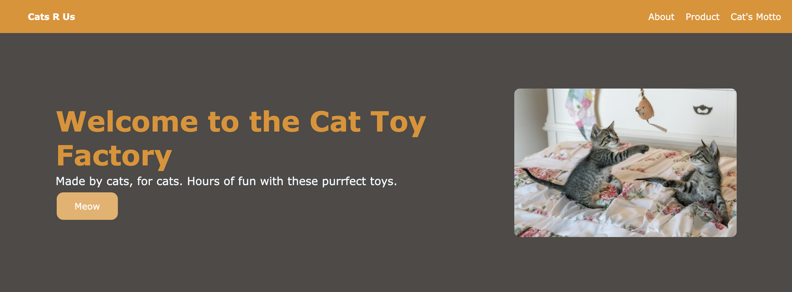
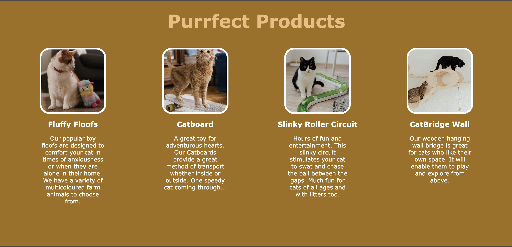
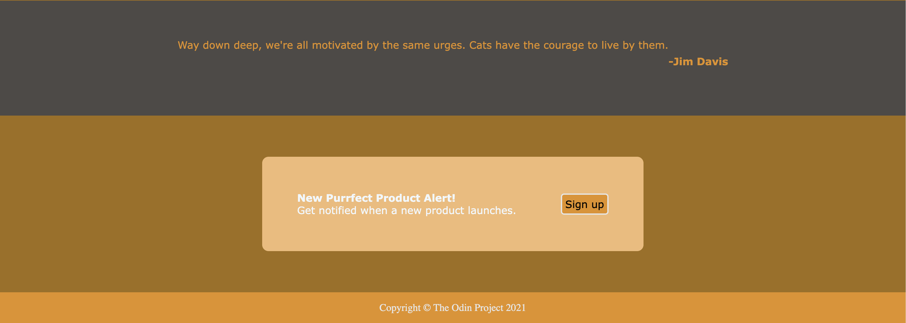

## Cat Toy Factory Landing page

I created a landing page using the image template provided by **The Odin Project**. 
As part of the learning experience, I replicated the design, but I  made it more fun and cat-themed.

## Live Demo

[**View the live project here**](https://aimei60.github.io/landing-page/)

## Technologies Used

- HTML5  
- CSS3  
- Flexbox  

## What I Learned

- Practiced building a responsive layout structure.
- Improved my understanding of Flexbox for positioning and alignment.
- Learned how to style a modern landing page.

## Preview

Here is a preview of the Landing Page

## Credits

All of the images are sourced from https://www.pexels.com/
